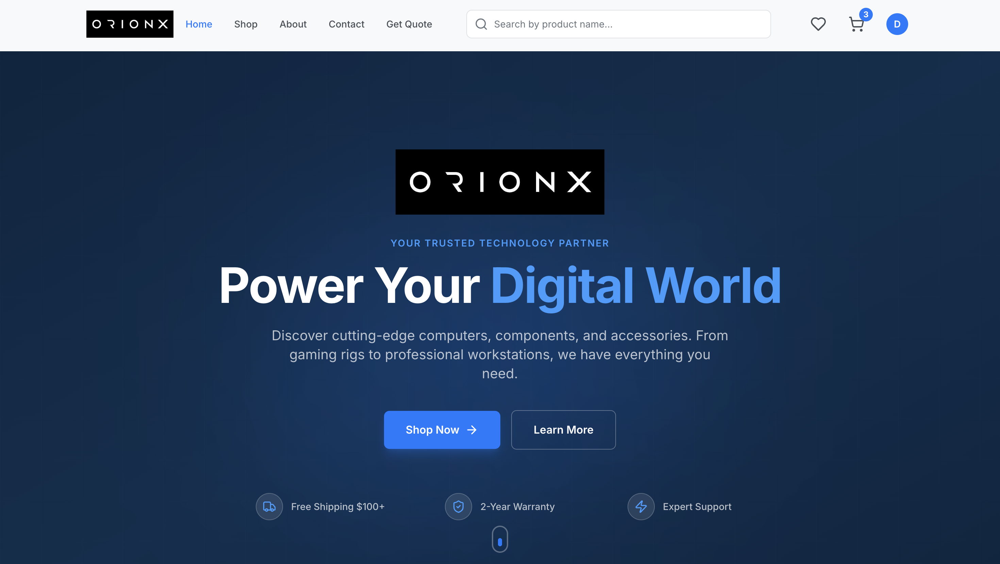

# OrionX E-Commerce Platform

A full-stack e-commerce called OrionX lets customers browse products, manage their cart and wishlist and place orders.



---

## Project Structure

```
orionx-ecommerce/
├── frontend/     # React + TypeScript web application
└── backend/      # Node.js + Express REST API 
```

---

## Core Features

### 🛍️ E-Commerce
- Product catalog with categories, brands, filtering, and search
- Product detail pages with images, specs, and ratings
- Shopping cart and wishlist management
- Order placement and order history
- Side-by-side product comparison
- Quotation requests
- Cloudinary-powered image uploads

### 👤 User Management
- JWT-based authentication (register / login)
- User profile management
- Admin dashboard for product and order management

---

## Tech Stack

| | Backend | Frontend |
|---|---|---|
| Language | JavaScript (ESM) | TypeScript |
| Framework | Express 5 | React 18 |
| Primary DB | MongoDB (Mongoose) | — |
| Styling | — | Tailwind CSS |
| Routing | — | React Router v6 |
| Build | Node.js | Vite |

---

## Quick Start

### 1. Clone the repository

```bash
git clone https://github.com/your-org/orionx-ecommerce.git
cd orionx-ecommerce
```

### 2. Set up the backend

```bash
cd backend
npm install
```

Create `backend/.env`:
```env
PORT=5050
MONGO_URI=mongodb+srv://<user>:<password>@cluster.mongodb.net/<dbname>
JWT_SECRET=your_jwt_secret

CLOUDINARY_CLOUD_NAME=your_cloud_name
CLOUDINARY_API_KEY=your_api_key
CLOUDINARY_API_SECRET=your_api_secret
```

```bash
npm run dev
```

### 3. Set up the frontend

```bash
cd frontend
npm install
npm run dev
```

## Documentation

| Module | README |
|---|---|
| Backend API | [`backend/README.md`](backend/README.md) |
| Frontend App | [`frontend/README.md`](frontend/README.md) |

---

## Application URLs

| Service | URL |
|---|---|
| Frontend | http://localhost:5173 |
| Backend API | http://localhost:5050 |
| Health Check | http://localhost:5050/api/health |

---

## Roadmap

- [ ] Product review and ratings system
- [ ] Real-time inventory updates
